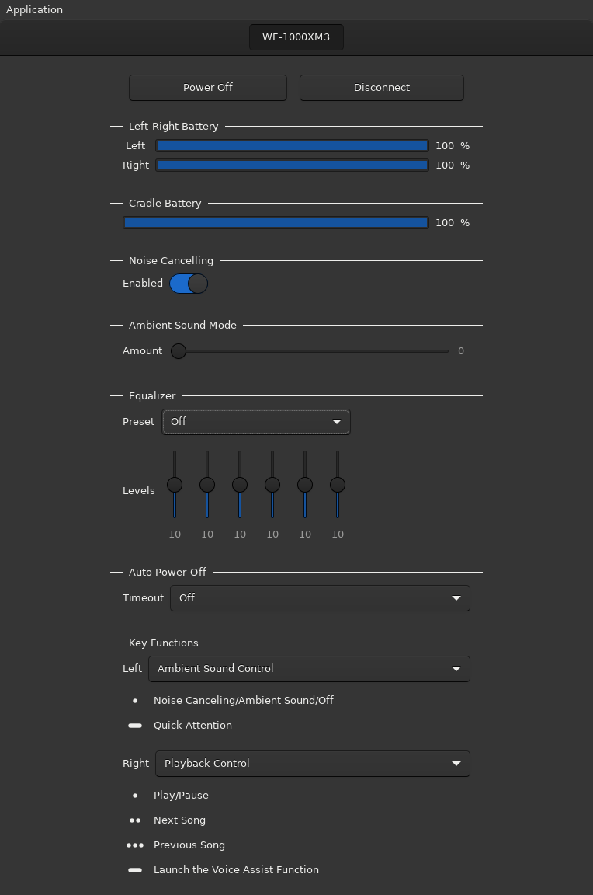

# MDR Manager

__MDR Manager__ is a GUI to view battery levels and change settings for MDR devices (Sony wireless headphones).

## Requirements

__MDR Manager__ is a frontend for [mdrd](https://github.com/AndreasOlofsson/mdrd), which is required to be running in order for __MDR Manager__ to work.

## Building

Simply run `make` in the project root.

### Dependencies

* a C compiler (gcc is recomended)
* pkg-config
* gio-2.0
* gtk+-3.0

